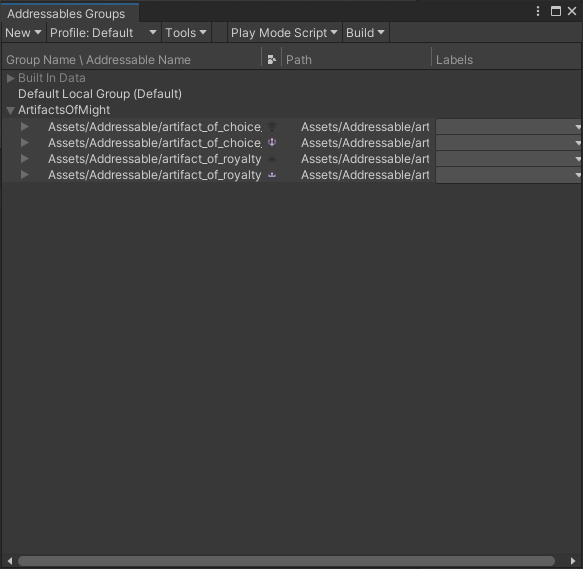

# Developers

Notes when devving

## Release

- Update the changelog
- Update the version in the solution file
- Run the `Release`

## Asset Bundle

### Artifact Icons

- Create the icon in Aseprite
- Export each layer with the name `_enabled` or `_disabled` plus the artifact name in the `icons` folder.

In our Unity project (or any project), make an asset bundle:

1. Import the icons into `Assets/Addressable`
1. Set texture type to `Sprite` 
1. Set the sprite as Addressable in the Settings
1. Use Window > Asset Management > Addressables -> Groups to view the groups

1. Drag the assets from the Default to Artifacts Of Might
1. Then use Build -> New Build -> Default Build Script
1. The location will be somewhere in the Library folder like: `Library\com.unity.addressables\aa\Windows\StandaloneWindows64`
  1. You can use the ArtifactsOfMight menu to find the location and make a build
1. Copy the bundle to the `assetbundles` location
1. Rename the prior one to `oldbundle.bundle` 
1. Rename the new one to `artifacts_of_might.bundle`
