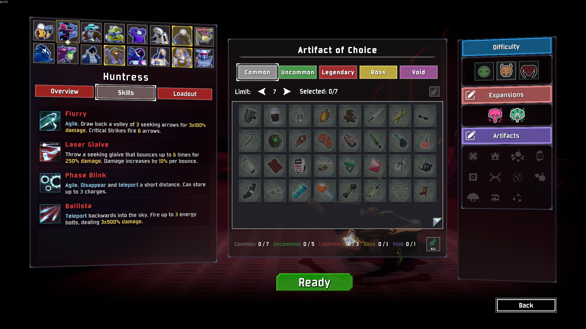
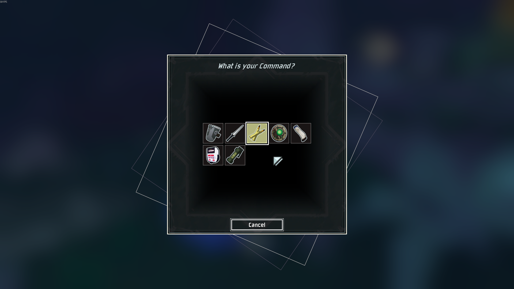

# Artifacts Of Might

Adds additional artifacts that restrict your choices, you might have a good time, you might not.

## Artifact of Choice

The Artifact of Choice currently only works when the _Artifact of Command_ is enabled. 

It provides a dialog that lets you limit which items will be available on the command picker.

1. Toggle the selection dialog with F7

1. Make your item choices, or choose the random options for a fun ride

1. In game, the command palette will be filtered to just those items (when available)

### Corrupted Items

The _Artifact of Choice_ automatically unlocks the curroptible version of the item once you have acquired the corrupted version,
for example if you have Needletick selected, Tri-Tip daggers will be available **once** you've acquired at least 1 Needletick.
